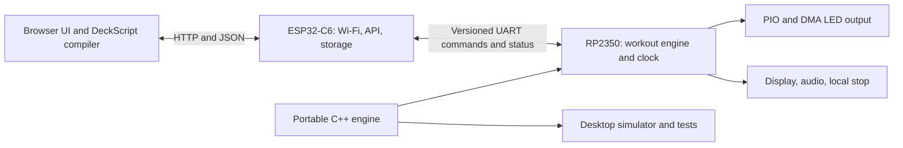

# Rabbit C++ migration plan

Review date: 2026-09-17. Source baseline: `2c9afe7`, branch `c++`.

This is a review and implementation plan; no firmware has been ported or flashed. The working assumption is **RP2350 and ESP32-C6 cooperating on one LilyGO T-Pico2350/T-Pico2 board**. Separate standalone RP2350 and ESP32 products would require additional board and networking adapters. Confirm the physical board revision before selecting pins or flashing images.

## Recommendation

Use C++17 for application code, Raspberry Pi Pico SDK/CMake on the RP2350, and ESP-IDF on the ESP32-C6. Keep the existing browser UI and JavaScript DeckScript compiler. Move the workout engine into a portable C++ library, first exercised on the desktop, then deployed to the RP2350.

The RP2350 owns workout state, time, LED output, audio, local controls, and its display. The ESP32-C6 owns networking, HTTP, browser assets, credentials, and persistent configuration. Transfer complete prepared plans across UART; execute them entirely on the RP2350.



Pico SDK supports C/C++, CMake, and CLion; its hardware APIs cover PIO and DMA. ESP-IDF supports C++ and supplies an HTTP server for ESP32-C6. These are two firmware builds with a shared library and protocol, not one cross-compiled image. Pin tested SDK/toolchain versions during bring-up. [Pico SDK](https://www.raspberrypi.com/documentation/microcontrollers/c_sdk.html), [PIO/DMA APIs](https://www.raspberrypi.com/documentation/pico-sdk/hardware.html), [ESP-IDF C++](https://docs.espressif.com/projects/esp-idf/en/stable/esp32c6/api-guides/cplusplus.html), [HTTP server](https://docs.espressif.com/projects/esp-idf/en/stable/esp32c6/api-reference/protocols/esp_http_server.html).

LilyGO's examples use Arduino and can serve as hardware reference tests. A Pico SDK board-support layer requires porting the necessary initialization and drivers; account for that work explicitly. If that effort dominates bring-up, evaluate an Arduino-Pico adapter using the same portable core before changing the application architecture. [Vendor build configuration](https://raw.githubusercontent.com/Xinyuan-LilyGO/Lilygo-T-Pico2/master/platformio.ini).

## Current implementation

| Area | Current source | Migration treatment |
| --- | --- | --- |
| HTTP, configuration, networking, startup | `main.py` (1,258 lines), `microdot.py` | Replace with ESP-IDF services and a compatibility API layer |
| Pool geometry, calibration, pacing, repetitions, LED output | `swimset.py` (712 lines) | Separate pure calculations/state machine from RP2350 drivers |
| Compiled workout validation and execution | `workout_runner.py` (334 lines) | Port semantics into the portable core |
| Cursor, beeps, displays | `ledcursor.py`, `audioalert.py`, `displays.py` | Preserve presentation concepts; replace blocking/hardware implementations |
| Coach UI and compiler | `index.html`, `js/navigation.js`, `js/deckscript.js`, CSS/static files | Retain browser implementation and asset paths |
| Stored data | `db/pools.json`, `db/sets.json`, `db/lastled.dat`; optional device `wifi.json` | Export/import through versioned storage adapters |
| Desktop emulation | `runtime_support.py`, `emulator/`, `emulator.html`, `js/emulator.js` | Reuse viewer concepts and HTTP contract with a native engine |
| Existing checks | `tools/test_*.py`, `tools/test_deckscript.js`, `tools/smoke_emulator.py` | Use as initial behavioral baseline; extend with native and device tests |

There is no checked-in C/C++ implementation or CMake build. The root README is empty. Firmware replacement therefore includes a build/deploy workflow and operating documentation, not just source translation.

## Review findings that affect the migration

These findings come from source inspection unless marked as test results. They are not measurements on the physical board.

| Priority | Finding and evidence | Required treatment |
| --- | --- | --- |
| High | **Existing drivers do not describe the target board.** `displays.py:41` uses a 320×170 parallel ST7789 arrangement with pins up to 48; `displays.py:171` selects hardware using module availability and a machine-name string. `swimset.py:246` uses LED GPIO16; `audioalert.py:12` uses GPIO15. | Define an explicit board profile, including external LED/audio wiring. Bring up the actual LCD, expander, power management, and serial link independently. |
| High | **Pool units and calibration have conflicting assumptions.** `workout_runner.py:175` and `main.py:1002` initialize length as 25; negative-split validation also assumes 25-unit lengths. `swimset.py:440` converts length to feet as yards, although `PoolData.get_corrected_bcm()` supports a 50-metre label. That method shifts segment indices against `lastled.dat`, while timing construction starts at fixed `FIRSTPIXEL=174`. | Introduce explicit units, actual pool length, strip pixel count, and calibrated physical distance-to-pixel mapping. Validate every imported range. Define expected results for each supplied pool before porting. |
| High | **Stop responsiveness is blocked by work inside the pacing loop.** `audioalert.py:18` sleeps through a triple beep for about 2.15 seconds. `swimset.py:511` can sleep at a turn. `main.py:1070` and `main.py:1204` wait at most two seconds and can then return “Stopped” without verified completion. | Use scheduled audio edges and nonblocking engine transitions. Acknowledge applied stop state, with bounded queues and measured output latency. |
| High | **HTTP handlers and the runner share mutable output/state.** Start has a lock, but calibration/strand handlers can write the same strand while a runner executes; status reads mutable fields. `main.py:1109` onward and `main.py:1152` illustrate the split ownership. | One RP2350 owner processes commands and publishes immutable snapshots. Reject calibration during a run. ESP HTTP tasks never mutate engine state directly. |
| High | **Credential reads bypass admin protection.** The GET branch of `main.py:1014` serves database files before checking `require_admin()`, including device Wi-Fi configuration if present. Startup/profile and POST logging also print credential-bearing data. | Make sensitive reads authenticated, remove secret logging, and return redacted credentials to the UI with explicit keep/replace semantics. Migrate the network-settings editor with this API change. |
| Medium | **Numeric and allocation bounds are incomplete.** Pool validation checks nonnegative pixel indices but does not prove they fit the allocated 910-pixel strand or form usable sections. `save_as_last_led` has no upper bound. Legacy repetition/distance inputs can drive large allocations. | Validate finite numbers, physical bounds, monotonic/nonzero sections, integer metadata, and total memory cost before activating a plan. Validate decoded serial commands as well as HTTP JSON. |
| Medium | **Fractional timing differs across paths.** `main.py:829` divides the fractional digits by 100 regardless of digit count: `30.5` becomes 30.05. Legacy prep then casts durations/intervals to integers. DeckScript accepts fractional numeric seconds. | Adopt one canonical integer time representation and rounding rule; document this as an intentional correction rather than silently reproducing it. |
| Medium | **Reconnect logic is present but not started by this entry point.** `network_watchdog_thread` is defined in `main.py:569`; graph context and a text search show no invocation. Startup reaches `run_control_server` directly. Missing Wi-Fi configuration is also not handled by `read_profiles`. | Implement and test an ESP-IDF Wi-Fi event state machine, bounded reconnect/backoff, and first-boot AP fallback. |
| Medium | **Storage replacement is not always atomic.** `main.py:262` falls back to deleting the old file before renaming the temporary file when `os.replace` is unavailable. | Use storage transactions with recoverable generations and fault-injection tests for interrupted writes. |

GitNexus impact analysis reports `set_bottom_times` as LOW with `prep` as a direct caller participating in six listed flows, and `rep` as LOW with direct callers `loop` and `sprintloop`. Source inspection also shows `WorkoutRunner._initialize_hardware` calling `set_bottom_times` and `WorkoutRunner.run` calling `rep`; these dynamic references are absent from those graph results. Treat graph counts as a lower bound. The behavioral migration risk is high across legacy pace, sprint, and DeckScript workflows even though the individual graph verdicts are LOW.

## Hardware bring-up contract

The vendor identifies an RP2350 with 520 kB SRAM/16 MB flash and an ESP32-C6 with 4 MB flash. The board uses a reversible USB connection for access to the two processors, and RP-side logic controls ESP reset. Preserve recovery access while developing custom ESP firmware. [Vendor board documentation](https://github.com/Xinyuan-LilyGO/Lilygo-T-Pico2).

The following are reference values, not an approved wiring manifest:

| Function | Vendor reference | Bring-up check |
| --- | --- | --- |
| LCD | ST7796, 222×480; SPI MISO4/MOSI7/SCK6, CS8/DC9 | Color order, offsets, orientation, and partial-window updates |
| Shared peripheral I2C | RP GPIO0/1 | Probe expander, PMU, and touch device; confirm addresses and startup order |
| LCD reset/backlight | Expander outputs 0/1 | Confirm polarity and usable backlight control |
| ESP link | RP TX28/RX29; flow-control pins 26/27 | Verify crossed directions and boot/reset behavior on the schematic |
| ESP enable | Expander output 3 | Do not hold ESP in reset during flashing/recovery |
| Local button | RP GPIO23 | Debounced stop and boot behavior |
| External LEDs and audio | Repository uses GPIO16/GPIO15 | Select accessible pins against the actual revision and any HDMI/shared functions |

[Vendor peripheral definitions](https://raw.githubusercontent.com/Xinyuan-LilyGO/Lilygo-T-Pico2/master/examples/Factory/utilities.h), [LCD configuration](https://raw.githubusercontent.com/Xinyuan-LilyGO/Lilygo-T-Pico2/master/lib/TFT_eSPI/User_Setups/Setup214_LilyGo_T_Pico2Pro.h).

Vendor resources contain naming/pin inconsistencies: for example, the README and factory header disagree on the QWIIC UART TX pin. Do not copy those assignments blindly. Record the board silkscreen/revision, schematic revision, verified pin table, LED part/order/rate, level shifting, strip power arrangement, and audio hardware before driver implementation. Do not assume optional external RAM is present or required.

## Compatibility boundaries

Keep these behaviors explicit in shared fixtures:

- Legacy pace and sprint, Near/Far starting direction, audio enabled/disabled, finite and continuous runs, prepare/start/stop/continue/cancel, and calibration tools.
- Legacy `negative_split` changes targets across repetitions; DeckScript `negativeSplit` changes the two halves of each repetition. They must remain separate strategies internally.
- DeckScript 2 `executionPlan` and `compactExecutionPlan`, including optional/default fields and all `s`/`r`/`a` entry shapes. Keep 256 entries, a 12 KiB prepare-request limit, names up to 64 characters, and labels up to 80 characters. Specify UTF-8 byte budgets separately from character counts so C++ buffers do not truncate valid text.
- `hold` is target duration; `on` is start-to-start timing; explicit rest follows completion. Respect `waitForInterval`, including no final send-off wait at a block boundary.
- Stop skips the interrupted swim/recovery; Continue advances to the next step. It is not a pause/resume operation. Existing activity entries clear output and advance immediately rather than waiting for human completion.
- Legacy sprint retains its starting direction per repetition and uses a single beep; ordinary repetitions use the existing triple-beep behavior. Capture initial-start, muted-audio, interval-too-short-for-beeps, final-repetition, and stop-during-beep cases before choosing corrected scheduling rules.
- Preserve calibration overlays where intended: `clear_strand()` currently redraws 15 m markers, so normal stop and fault blackout need distinct output policies.

The browser remains the DeckScript compiler. The controller accepts only validated execution plans; it does not need a C++ parser for the source language. This preserves most of the existing UI investment. [Existing contract](deckscript.md).

Retain URLs, methods, field names, error shapes, and status behavior through compatibility handlers:

| Surface | Endpoints |
| --- | --- |
| Static UI | `/`, `/favicon.ico`, `/css/*`, `/js/*`, `/static/*` |
| Legacy control | `/prep`, `/start`, `/startsprint`, `/stop`, `/cancel-prep` |
| Workouts and status | POST `/api/workout/prepare`, POST `/api/workout/start`, GET `/api/set-status` |
| Configuration | `/loadpools`, GET/POST `/db/pools.json`, `/db/sets.json`, `/db/wifi.json` |
| Calibration | `/IgniteLedLoc/*`, `/saveaslastled/*`, `/LightStrand`, `/ClearStrand`, `/LightSegment`, `/ignitemarkers` |
| Recovery | `/HardReset`, with documented behavior for both processors |
| Desktop diagnostics | `/emulator`, `/api/emulator/state`, `/api/emulator/pool-profile` |

Keep desktop diagnostics available in the native simulator; decide separately whether to expose lightweight equivalents in production. Do not restore arbitrary filesystem access such as a generic database/prototype path server. Use explicit allowlists. Preserve public pool/set reads only if intended, and require admin credentials for writes, controls, and sensitive reads. Legacy mutating GETs can be compatibility aliases; replacement POST controls and same-origin checks can be introduced with coordinated UI changes.

## Native design

### Portable engine

Create small modules for `PoolGeometry`, `PacingPlan`, `WorkoutEngine`, `CursorRenderer`, `AudioSchedule`, and protocol serialization. Use explicit enums/structs, integer microseconds on a monotonic 64-bit clock, explicit distance units, and deterministic rounding of segment durations so they sum to the intended total.

Expose command application and `advance(now)` behavior with bounded work. Suggested internal states are Idle, Prepared, PreStart, Swimming, Resting, Stopping, Stopped, Complete, and Fault. Publish a versioned snapshot for HTTP/display formatting. The engine accepts clock readings and produces output/events; it has no socket, filesystem, SDK, or sleep dependencies.

Start with one RP2350 application owner loop, PIO/DMA output, and bounded display transfers. Reserve the second core until profiling justifies its synchronization cost. Use fixed-capacity storage or prepare-time arenas, RAII for drivers, explicit error returns, and no allocations in pacing/interrupt paths. Disable exceptions/RTTI in embedded builds unless a selected dependency requires them. Host tests can use richer tooling without changing engine behavior.

Store geometry as calibrated sections with a physical-distance lookup, rather than copying all the Python per-pixel timing arrays. Clamp every rendered pixel to the actual strip length; define consistently whether the saved last-LED value is an inclusive index. Support explicit 25-yard, 25-metre, and 50-metre profiles. During the initial migration, reject unsupported partial-length plans clearly rather than silently rounding to a whole length; adding partial-length execution is a separately tested extension.

### UART contract

Use framed messages with protocol version, message type, boot/session ID, request ID, payload length, and CRC. COBS with a delimiter is a suitable framing choice. Serialize integers with a specified byte order; never transmit raw C++ structs. CRC detects transmission corruption, not authorization.

- Begin with 115200 baud to match the vendor reference; qualify a higher rate such as 921600 only after stress testing. [Vendor UART example](https://raw.githubusercontent.com/Xinyuan-LilyGO/Lilygo-T-Pico2/master/examples/ATDebug/ATDebug.ino).
- Bound frames to about 256 payload bytes initially, with bounded RX/TX buffers, timeouts, and flow control verified electrically. Do not enqueue an entire upload ahead of Stop.
- Transfer plans using BEGIN/CHUNK/COMMIT, a total-size bound, and an end-to-end checksum. Validate into a staging buffer and atomically replace the prepared plan only after successful validation. Reject preparation while running; an interrupted transfer leaves the previous plan intact.
- Include plan ID and pool/calibration revision in Prepare and Start. RP2350 validates both. ESP persistence owns the durable configuration; a prepared RP plan uses an immutable snapshot of it.
- Prioritize Stop and local controls over uploads and telemetry. Duplicate Start requests must return the recorded result, not restart a workout. Session IDs invalidate commands from before a reboot; rejected/queued/applied responses are distinct.
- Report status sequence, boot ID, applied request ID, fault, and snapshot age. The ESP must never present stale “running” telemetry as current. Time out HTTP waits without claiming a command succeeded; resolve uncertain outcomes by request ID/status.
- Wi-Fi loss alone does not stop an already accepted local workout. Proposed link-loss policy: three seconds without an ESP heartbeat causes RP2350 to stop outputs and require explicit recovery. Keep the heartbeat independent of browser presence. Confirm this policy before field deployment.
- Either processor reboot triggers a handshake and state reconciliation. RP2350 boots idle with outputs off. An ESP reboot does not replay queued Start commands. Physical local stop works without Wi-Fi or ESP cooperation.

12 KiB requires roughly 1.07 seconds on a 115200-baud 8N1 UART before framing/acknowledgments. This is acceptable for Prepare, but demonstrates why command transfer cannot drive per-pixel timing. A lost connection or slow upload must never extend a pacing deadline.

### ESP services and persistence

Use separate responsibilities for Wi-Fi events, HTTP handling, serial transport, and storage. The HTTP server's APIs are not inherently thread-safe; marshal responses/work appropriately instead of sharing request handles across unsynchronized tasks. Bound slow clients and concurrent requests so a blocked upload cannot starve control. [ESP-IDF server guidance](https://docs.espressif.com/projects/esp-idf/en/stable/esp32c6/api-reference/protocols/esp_http_server.html).

Serve the existing assets from generated compressed firmware resources. Use NVS for small configuration/secrets and a pinned LittleFS component for saved workouts and larger JSON. Pin dependency versions and inspect their build/flash-concurrency requirements. [ESP-IDF NVS](https://docs.espressif.com/projects/esp-idf/en/stable/esp32c6/api-reference/storage/nvs_flash.html), [LittleFS component](https://components.espressif.com/components/joltwallet/littlefs).

Import exported MicroPython JSON rather than interpreting its raw filesystem layout. Preserve names, set formats, source text, pool calibration, and inclusive last-LED semantics. Wi-Fi import must use a private provisioning channel and must not enter Git or logs. Validate in staging, write a checksummed generation, verify it, then activate it while retaining the previous valid generation. A mount failure must not automatically format user data. Configuration edits cannot mutate an active RP plan.

Keep the 12 KiB compiled-plan bound distinct from saved-source bounds: one saved DeckScript source can already be 16,384 characters, and `sets.json` can contain multiple sets. Choose and document collection/file/pool limits after inventorying deployed data. Reject oversized import before changing storage and retain an export/backup path.

Prepare an ESP partition budget from the actual 4 MB module and measured binary/assets sizes. Do not assume dual OTA slots, all saved data, and assets automatically fit. First release should support recoverable USB flashing of each chip and ship a manifest pairing firmware/protocol versions. ESP OTA can follow using ESP-IDF rollback support; RP2350 remote update requires its own recovery design. [ESP-IDF OTA](https://docs.espressif.com/projects/esp-idf/en/stable/esp32c6/api-reference/system/ota.html).

## Performance and resource gates

These are initial engineering targets, not measurements or existing product guarantees:

| Item | Initial budget or acceptance target |
| --- | --- |
| Internal pacing | Absolute monotonic deadlines; scheduler lateness at most 1 ms under qualified load; preserve planned start-to-start timing without accumulated software drift |
| Clock accuracy | Measure oscillator drift over at least one hour against a reference; separate clock error from scheduler lateness and establish a product tolerance |
| Stop | Outputs settle within 100 ms of RP command receipt or local button recognition; separately measure browser-to-output latency |
| LED refresh | Assuming 800 kbit/s, 24-bit pixels: 910 pixels take 27.3 ms plus reset/latch; target about 30 Hz, never promise per-pixel sub-millisecond visible updates |
| LED buffers | 2,730 bytes per packed RGB frame at 910 pixels; budget DMA-specific packing and double buffering separately |
| LCD | A full 222×480 RGB565 frame costs 213,120 bytes; use partial updates/tile buffers rather than allocating two full frames |
| Plan | At most 256 entries/12 KiB prepare JSON; account separately for decoded structs, UTF-8 labels, staging, and geometry |
| Telemetry | Initial 5 Hz snapshots with bounded/coalesced queues; retain the coach UI's current 2-second polling behavior |
| Memory | Map-file and stack/heap high-water reports for each build, no engine allocations while running, and explicit margin under worst-case plan/storage/network load |
| Recovery | Power loss, malformed frames, serial disconnect, and either MCU reboot must lead to documented states without an unintended restart |

At maximum strip length, compute the position for the intended display time and skip obsolete frames instead of delaying the workout to draw every intermediate LED. Measure DMA completion/latch effects and audio-to-light alignment with a logic analyzer. Do not mistake a fast engine tick for a faster serial LED bus.

## Delivery sequence

| Phase | Deliverables | Exit gate |
| --- | --- | --- |
| 0. Freeze behavior and hardware | Board/wiring manifest; exported device data; route/schema inventory; reference traces; defect/intentional-change ledger | Every workflow has expected behavior; pin/reset and LED/audio hardware questions resolved; known-good firmware/data backed up |
| 1. Establish native builds | Portable core skeleton; host CMake tests; Pico SDK RP2350 target; ESP-IDF C6 target; reproducible dependency pins and CI | Clean host/RP/ESP builds from a fresh checkout; USB logs and recovery proven on both chips |
| 2. Port deterministic core | Geometry, validation, pacing strategies, state machine, cursor and audio schedules | Golden/differential fixtures pass for supported legacy and DeckScript cases; deliberate corrections have explicit expected results |
| 3. Bring up RP peripherals | Board initialization, LCD, local stop, LED PIO/DMA, audio, watchdog | One local workout runs without ESP; bounds, stop latency, direction, markers, and waveform measurements pass |
| 4. Implement serial contract | Framing/parser, handshake, transactional prepare, acknowledgments, snapshots, reconnect | Corrupt/truncated/repeated/out-of-order frames, upload interruption, queue saturation, and either-MCU reset tests pass |
| 5. Port ESP application | Wi-Fi/AP setup, HTTP compatibility, existing web assets, storage/import, admin controls | Current browser can prepare/run/stop/save/reload all supported modes on hardware; negative API tests and power-loss persistence tests pass |
| 6. Native simulation and qualification | Native desktop adapter, viewer/status parity, sanitizers, automated end-to-end tests, field measurements | Extended continuous runs, maximum plans, repeated clients, Wi-Fi churn, flash writes, and restart tests meet budgets |
| 7. Cut over | Paired firmware release, migration/import guide, recovery images, installation instructions | Physical-pool acceptance, successful backup/restore and rollback drill, and no MicroPython runtime dependency on either device |

Dependencies: phase 0 precedes hardware decisions; phase 1 precedes native implementation; phase 2 precedes timing qualification; phases 3–5 converge before phase 6. Move one validated subsystem at a time while keeping the Python version usable as a reference. Do not delete it until phase 7 acceptance.

Suggested implementation layout:

```text
firmware/
  core/                 # Portable domain calculations and engine
  protocol/             # Explicit wire schema, codec, shared constants
  rp2350/               # Pico SDK project and verified board drivers
  esp32/                # ESP-IDF project, HTTP, Wi-Fi, storage
  host/                 # Desktop adapter and simulator executable
tests/
  fixtures/             # Plans, API examples, geometry and timing traces
  native/               # Engine/protocol tests with a fake clock
  integration/          # HTTP/serial scenarios and device harness
```

Use separate build directories/toolchains for host, ARM RP2350, and RISC-V ESP32-C6. Keep JS/HTML/CSS as shared source assets rather than duplicating them into each firmware tree. Add CLion CMake profiles for host and Pico SDK, and document the ESP-IDF environment/build workflow. Python may remain a development/test/SDK tool; the migration removes the MicroPython runtime from production hardware.

The first implementation slice should be the host-buildable `PoolGeometry` and pacing engine with fake-clock fixtures from the current three pools, followed by one RP2350 local workout. This resolves the highest-risk behavior before networking and storage are integrated.

## Verification completed for this review

- `python3 tools/test_workout_runner.py` — passed.
- `python3 tools/test_swimset_display.py` — passed.
- `node tools/test_deckscript.js` — passed.
- `python3 tools/smoke_emulator.py` — passed in an isolated temporary checkout so its configuration writes did not touch the working copy.

These checks cover existing host behavior, not native timing or electrical correctness. The runner tests use a fake SwimSet, the display test is small, and desktop clocks do not exercise MicroPython tick wrapping. Add geometry edges, invalid calibration, fractional values, stop at every transition, duplicate Start, continuous cycling, communication failures, and reset/power-loss cases to the migration fixtures. Use native address/undefined-behavior sanitizers and parser fuzzing where supported, plus logic-analyzer and real-device tests.

No physical device was accessed. No native firmware was built: `cmake`, `arm-none-eabi-g++`, and `idf.py` were not found on this session's PATH. Toolchain installation/configuration belongs to phase 1.

## Decisions still to confirm

1. Dual-chip LilyGO board versus independent standalone targets, and exact board revision.
2. Actual LED protocol/count/color order/pin/power interface and audio circuit.
3. Supported pool lengths/units, partial-length requirements, and intended calibration interpretation.
4. Preferred behavior after ESP/UART failure; the proposed default is stop after a three-second heartbeat timeout.
5. Whether local touch UI, SD, battery telemetry, or OTA is required for initial parity. The current application does not establish those as mandatory features.

If standalone ESP32 operation is also required, reuse the same portable engine locally, supply an ESP LED/output backend, and replace the UART engine client with an in-process command adapter. A standalone RP2350 target needs a specified network module or a USB/local-control-only product definition. These are additional qualification targets rather than assumptions hidden in the first migration.
