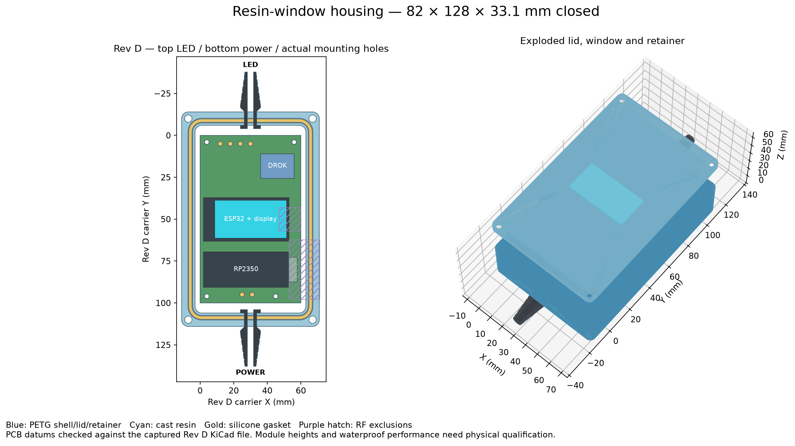
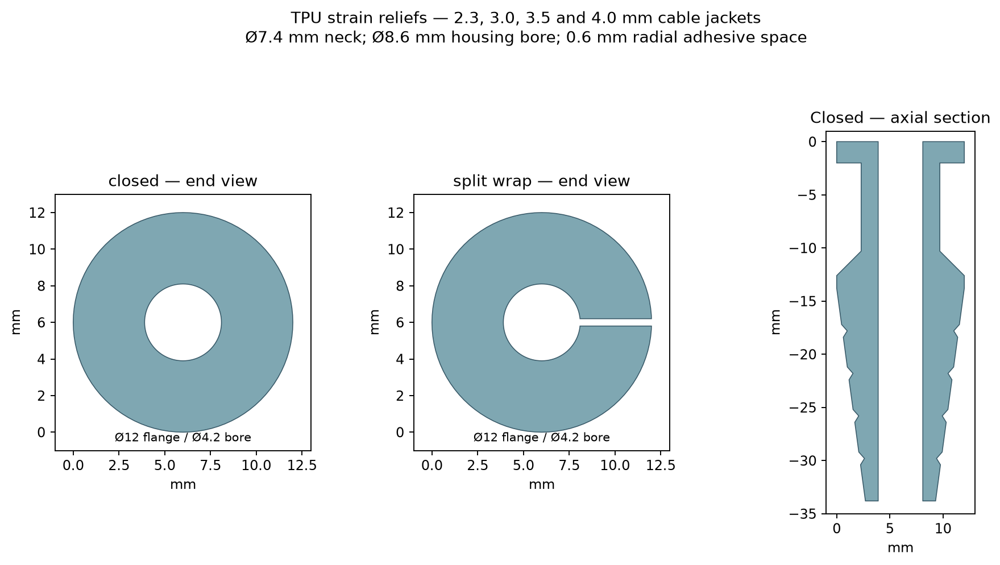

# Rev D housing with cast-resin viewing lid

Printable housing for the **`rev_d_case` 60 × 100 mm carrier PCB**, with a clear resin window centered over the ESP32 display. The assembled shell is **82 × 128 × 33.1 mm**, excluding the cable boots. Viewed with the screen facing you, the **LED cable exits the top end** and **power enters the bottom end**. Both glands share the case and display centreline at **X = 30 mm**, with internal leads running to J6 and J5. Both entries accept the same relief neck; choose reliefs for **2.3, 3.0, 3.5 or 4.0 mm complete cable jacket diameters**.

This replaces the earlier 88 × 58 mm compact-carrier housing. PCB outline, mounting holes and socket positions are checked against the captured [Rev D KiCad board](reference/Rabbit_Carrier_RevD.kicad_pcb). Module heights, actual LCD datum and sealing still require first-article checks. **Physical fit and leak testing have not been performed; it has no verified waterproof/IP rating.** Print the coupons first, then qualify frequent splashes and brief submersion up to 3 ft.



## Files and print quantities

All STL dimensions are millimetres. Each STL is already placed on the print bed in its intended orientation. Import at 100% scale.

| Part | Quantity | Material / purpose |
| --- | ---: | --- |
| [Body](stl/body_petg.stl) | 1 | PETG; open side up; blind insert pockets, cord groove and four integral Rev D standoffs |
| [Lid frame](stl/lid_frame_petg.stl) | 1 | PETG; outside face down; doubles as the resin casting frame |
| [Window retainer](stl/window_retainer_petg.stl) | 1 | PETG; sealant groove faces up in the slicer, toward the lid in assembly |
| [Cable entry coupon](stl/cable_entry_fit_coupon_petg.stl) | 1 optional | PETG; reproduces the horizontal bore and 8 mm wall thickness |
| [Resin casting coupon](stl/resin_cast_fit_coupon_petg.stl) | 1 optional | PETG; small version of the cast window flange |
| [Coupon retainer](stl/resin_coupon_retainer_petg.stl) | 1 optional | PETG; tests mechanical retention and the resin/PETG seal |
| [Unused entry plug](stl/unused_entry_plug_tpu.stl) | As needed | TPU; seal into any unused entry |
| Cable reliefs below | 1 per cable | TPU; inside flange on the bed, cable bore vertical |

| Cable jacket outside diameter | Closed relief | Split wrap relief | Nominal bore |
| --- | --- | --- | ---: |
| 2.3 mm | [STL](stl/strain_relief_2_3mm_closed_tpu.stl) | [STL](stl/strain_relief_2_3mm_split_wrap_tpu.stl) | 2.5 mm |
| 3.0 mm | [STL](stl/strain_relief_3_0mm_closed_tpu.stl) | [STL](stl/strain_relief_3_0mm_split_wrap_tpu.stl) | 3.2 mm |
| 3.5 mm | [STL](stl/strain_relief_3_5mm_closed_tpu.stl) | [STL](stl/strain_relief_3_5mm_split_wrap_tpu.stl) | 3.7 mm |
| 4.0 mm | [STL](stl/strain_relief_4_0mm_closed_tpu.stl) | [STL](stl/strain_relief_4_0mm_split_wrap_tpu.stl) | 4.2 mm |

Closed reliefs can be fitted before feeding the cable through. Split wraps open along a 0.4 mm radial seam for already terminated cables; that seam must be filled and sealed. The specified wire sizes refer to the **complete insulated jacket**, not the conductor diameter. A common jacket around multiple conductors needs its own measured relief bore.



## Dimensions and hardware assumptions

See [dimensions.svg](dimensions.svg) for the plan. Coordinates below follow the carrier drawing: X right, Y down; Z up from the outside bottom of the enclosure.

| Feature | Nominal dimension |
| --- | --- |
| Carrier PCB | Rev D, 60 × 100 × 1.6 mm |
| PCB mounting holes | Ø2.7 mm at (4,4), (56,4), (4,96), **(45,96)** |
| Integral standoffs | Ø6 mm, 2.5 mm above the floor; Ø2.0 mm blind pilots for M2.5 plastic-tapping screws |
| PCB underside | Z = 5.5 mm; 2.5 mm clearance over the 3 mm floor |
| Space above PCB | 22 mm to lid; 20 mm under the window retainer |
| Estimated LCD front plane | 18.35 mm above PCB top; 1.65 mm below the retainer, 3.65 mm below the resin |
| Viewing opening | Rev D provisional aperture, 43.5 × 23.5 mm, corner radius 1 mm |
| Viewing opening centre | Carrier X = 30, Y = 50 mm |
| Cast resin | 4 mm thick at the viewing opening; 55.5 × 35.5 × 2.4 mm rear flange, corner radius 3 mm |
| Resin amount | About 6.3 mL net; allow for mixing/cup losses |
| Window retainer | 63.5 × 43.5 × 2 mm; continuous 1.2 mm wide × 0.6 mm deep sealant groove |
| Retainer screw centres | (11,30.25), (49,30.25), (11,69.75), (49,69.75); clear of RF exclusions |
| Cable holes | Ø8.6 mm through the 8 mm top and bottom end walls |
| LED entry | Top end (−Y), centered at X = 30; wall spans Y = −14 to −6; cable axis Z = 15 |
| Power entry | Bottom end (+Y), centered at X = 30; wall spans Y = 106 to 114; cable axis Z = 15 |
| Relief neck / collar | Ø7.4 mm neck, 8.3 mm between collar faces; Ø12 mm collars |
| Glue clearance | 0.6 mm radial gap around relief neck; 0.1 mm nominal radial gap around cable |
| Relief length | 33.8 mm total; approximately 24 mm projects outside the case |
| Main gasket | 2 mm silicone cord in a 2.8 × 1.5 mm groove; nominal 25% squeeze at the flat rim stop |
| Gasket centreline length | About 367 mm; cut/join to the actual printed groove |

The ESP board envelope is 51 × 26 mm at carrier X=1.86, Y=37; the RP2350 is 51 × 21 mm at X=1.86, Y=69.5, with a 4.92 mm radio extension to the right. The visible display centre is (30,50), while the ESP PCB centre is (27.36,50). The 2.64 mm offset comes from the Rev D case datum: J3 pad 1 + (26.77,8.89). The active display is 42.72 × 22.70 mm and clears the modeled opening. Confirm the first article against [Waveshare dimensions](https://docs.waveshare.com/ESP32-C6-LCD-1.9); the Rev D documentation flags the manufacturer archive's S3-named mechanical model as provisional for the C6 board.

The four standoffs match the carrier's real mounting holes, including the deliberately offset lower-right hole. USB connectors remain enclosed; for USB service, remove the lid and lift the controller from its sockets to give the plug room. Both end-wall glands are centered at X=30; route their internal leads to J6 at the top and J5 at the bottom. The lid and base remain intact. Verify actual cable jacket diameters, collar installation, wiring bends, socket engagement and assembled module height before printing the full body. The LCD face height is the Rev D estimate; RP and DROK heights are conservative illustrative reservations, not measured assemblies.

Both ends have 6 mm clearance for the inner cable collars and wiring. Side clearance accommodates the resin flange/retainer; the 8 mm rim provides room for the cord seal and lid screws outside it. The shell adds about 24 mm of external boot projection at each end.

The RP RF exclusion is (52.78,62.25)–(71.28,97.75); the ESP exclusion is (47,43)–(60,57). Case fasteners are checked against both regions, and the lower retainer screws are moved inward accordingly. The RP exclusion extends 11.28 mm past the PCB edge: the plastic wall may occupy this area, but keep wires, added electronics, metal mounting hardware and conductive coatings clear.

## Materials and fasteners

- PETG for body, lid and retainer; this version is sized for PETG printing. A change to PP requires new fit and adhesive trials.
- TPU, starting with 95A, for reliefs and unused-port plugs. Softer TPU may ease installation, but fit must be checked on the coupon.
- Optically clear two-part casting epoxy suitable for a **4 mm section**, with the manufacturer's mixing ratio and full cure time. For example, read the [clear casting epoxy technical sheet](https://www.smooth-on.com/tb/files/EPOXACAST_690_692_TB.pdf) when choosing resin; optical clarity, sunlight exposure and adhesion need your own coupon trial.
- Flexible neutral-cure sealant compatible with the specific cured resin, PETG, TPU and cable jacket. Confirm adhesion and immersion suitability on the coupons.
- Approximately 380 mm of 2 mm silicone cord, with a sealed end joint, or a custom continuous silicone gasket matching the groove.
- Four M3 heat-set inserts, nominal 4.6 mm outer diameter × 4 mm long; the body pilot pockets are Ø4.4 × 4.2 mm. Match the actual insert supplier's hole recommendation before printing.
- Four M3 × 8 mm button-head machine screws. The lid has Ø6.4 × 1.8 mm head recesses; use heads that fit them.
- Four M2 × 5 mm plastic-tapping screws for the window retainer, using Ø1.7 mm blind pilots. The casting coupon uses four more M2 × 5 screws temporarily.
- Four M2.5 × 6 mm plastic-tapping screws for the PCB, using its existing Ø2.7 mm clearance holes and the standoffs' Ø2.0 mm blind pilots. Their nominal engagement is 4.4 mm, leaving about 1.1 mm of solid base underneath. Qualify thread grip before installing the board.

## Printing

Start with a 0.4 mm nozzle, 0.2 mm layers, six PETG perimeters and solid floor/lid layers. Use at least 15 bottom layers for the 3 mm floor, and 100% infill for the frame and retainer. Use four TPU perimeters and 100% infill; print the reliefs upright as supplied. These are starting settings, not a waterproof process specification.

The body and cable coupon have horizontal circular bores. Inspect sagging and clean the bore gently; qualify relief fit using the coupon printed with the same profile. The other parts have no enclosed support cavities. Keep supports out of the cord groove, casting pocket and cable bore. A small brim can help the upright coupon and TPU parts.

Inspect printed seams and layer bonding. Seal any porosity with a compatible thin coating and keep gasket lands flat and clean. FDM watertightness depends on the print process; see [Prusa's watertight-print experiments](https://blog.prusa3d.com/watertight-3d-printing-pt1-vases-cups-and-other-open-models_48949/). Do not treat a watertight STL mesh as evidence of a watertight print.

## Casting and assembly

1. Print the cable and resin coupons and the required relief diameter. Check the fit on the actual cable, collar insertion, glue filling, resin cure and sealant adhesion. The coupon has a 20 × 14 mm viewing opening with the same 4 mm optical thickness and 2.4 mm rear flange construction.
2. Print the full lid. Its outside face is the flat face that was on the print bed; its inside face contains the larger stepped casting pocket. Clean the pocket and prepare the PETG bond surfaces as required by the resin/sealant supplier.
3. Place the outside face **down on flat, release-treated glass**, leaving the stepped inside pocket facing up. Hold the frame flat and seal the temporary mould contact so resin cannot escape under it. Keep mould release off the permanent bond surfaces. Pour through the central opening and fill the larger rear pocket flush with the inside face. The glass forms the smooth optical face; the wider pocket forms the retaining flange. Cast with the electronics removed and allow full cure.
4. Clean flash from the window and inspect it. Fill the retainer's continuous groove with compatible sealant. The groove straddles the resin/PETG seam when the ring is installed. Put the ring against the inside lid, **groove toward the lid**, and use the four M2 × 5 screws. Tighten gently and cure the sealant. The rear ring supports inward water pressure on the resin flange; the outer PETG ledge prevents outward movement. The sealant closes the seam.
5. Install the four M3 inserts flush with the body rim. Avoid disturbing the adjacent cord groove. Fit the silicone cord, sealing its joined ends; its compression is set by the lid touching the flat rim.
6. Fit each TPU relief with the smaller flat flange inside and the tapered boot outside. Try folding the inner TPU collar through the coupon before committing to the case. Closed reliefs are installed before feeding the cable; split wraps can be opened around it. Seal the entire neck-to-wall annulus, cable-to-bore gap, and split seam over the collar/neck region. Use continuous intact cable jacket at the seal. Cure fully. Seal a TPU plug into an unused entry.
7. Leak-test the empty enclosure with dry paper inside: frequent splashes, then brief submersion progressing to the intended maximum of 3 ft. Gently move the cables during testing and inspect the window seam, cable entries, cord joint and printed walls. Fix and retest any ingress before installing electronics.
8. Place the Rev D carrier on the four standoffs with J6 at the LED end and J5 at the power end. The lower-right hole is at X=45, not X=56. Use four M2.5 × 6 screws through the PCB holes. Keep cable routing away from the antenna zones. Check real display height/alignment, cable bends and clearance under the retainer. Close using the four M3 lid screws evenly until the rim meets; avoid crushing the PETG or over-tightening plastic-tapping screws.

## Editing and regenerating

The editable design is [parameters.json](parameters.json) plus [generate_resin_housing.py](generate_resin_housing.py). Change assembled clearance, resin window dimensions or cable positions there. PCB datums are tied to the captured [Rev D board](reference/Rabbit_Carrier_RevD.kicad_pcb), copied from `/home/codiak/hgfs/vmshared/Rabbit_Carrier/rev_d_case/`. The [original case plan](reference/RevD_Case_Plan.svg) and [display alignment](reference/RevD_Horizontal_Alignment.svg) record the mechanical datum assumptions. The original plan's wiring arrows mark PCB connection positions; this housing uses centered glands as specified in `parameters.json`. The SHA-256 identifies the exact PCB input. A different board revision requires a new source reference and reviewed mounting/module datums.

The generator checks source checksum, PCB outline/thickness, all four mount holes/drills, socket rows, DROK origin, module placement and LCD centre against the KiCad file. It exports 15 STLs, the dimension drawing, previews and [validation.json](validation.json), checking connected watertight meshes, winding, exported STL reloads, assembly collisions, print-bed placement, LCD visibility, correct top LED/bottom power assignment and case-metal clearance from both RF exclusions. Both window and carrier screw holes are blind; only the two sealed cable holes open through the shell.

```sh
python3 -m venv /tmp/rabbit-housing-venv
/tmp/rabbit-housing-venv/bin/pip install -r mechanical/resin_housing/requirements.txt
/tmp/rabbit-housing-venv/bin/python mechanical/resin_housing/generate_resin_housing.py
```

To generate a variant without overwriting these files:

```sh
/tmp/rabbit-housing-venv/bin/python mechanical/resin_housing/generate_resin_housing.py \
  --parameters /path/to/variant.json --output /tmp/rabbit-housing-variant
```

The obsolete corner-clip STL from the compact-carrier design has been removed. Use this release's complete body/lid/retainer set together. A fit-check failure is a reason to inspect the changed geometry. The released files passed all geometric checks with the supplied parameters. Sealing, screw grip, resin adhesion and print tolerances still require the physical trials described above.
